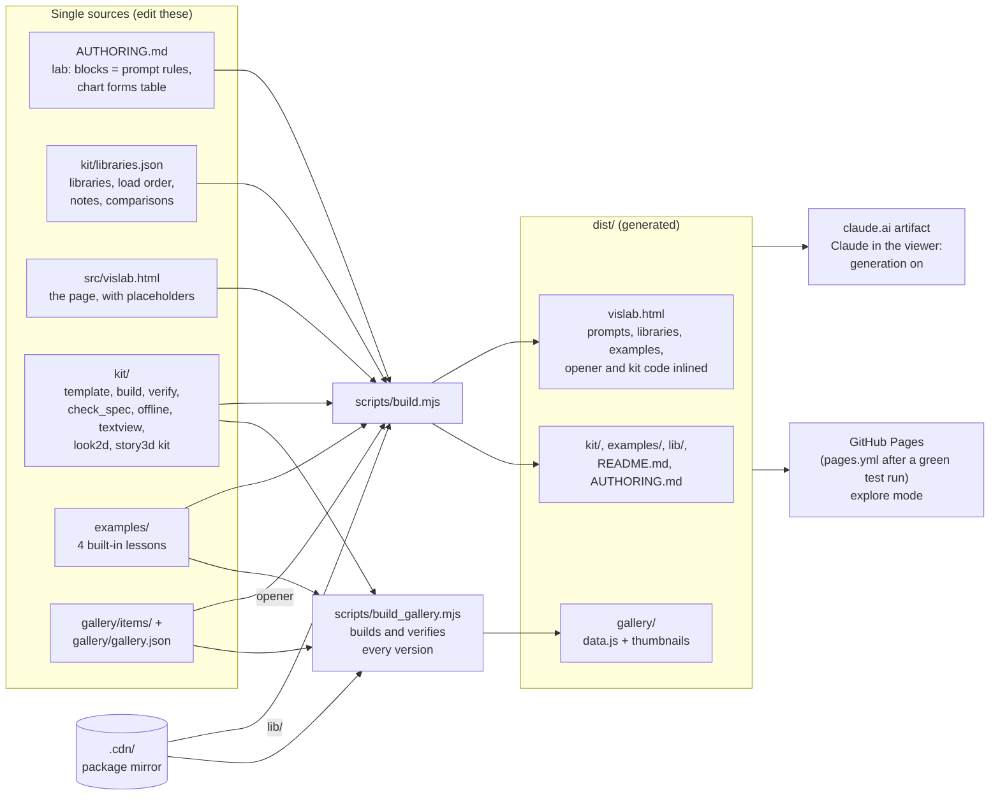
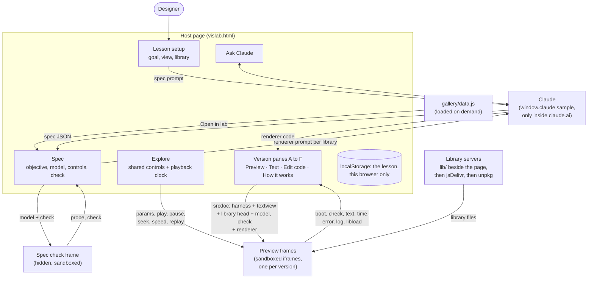
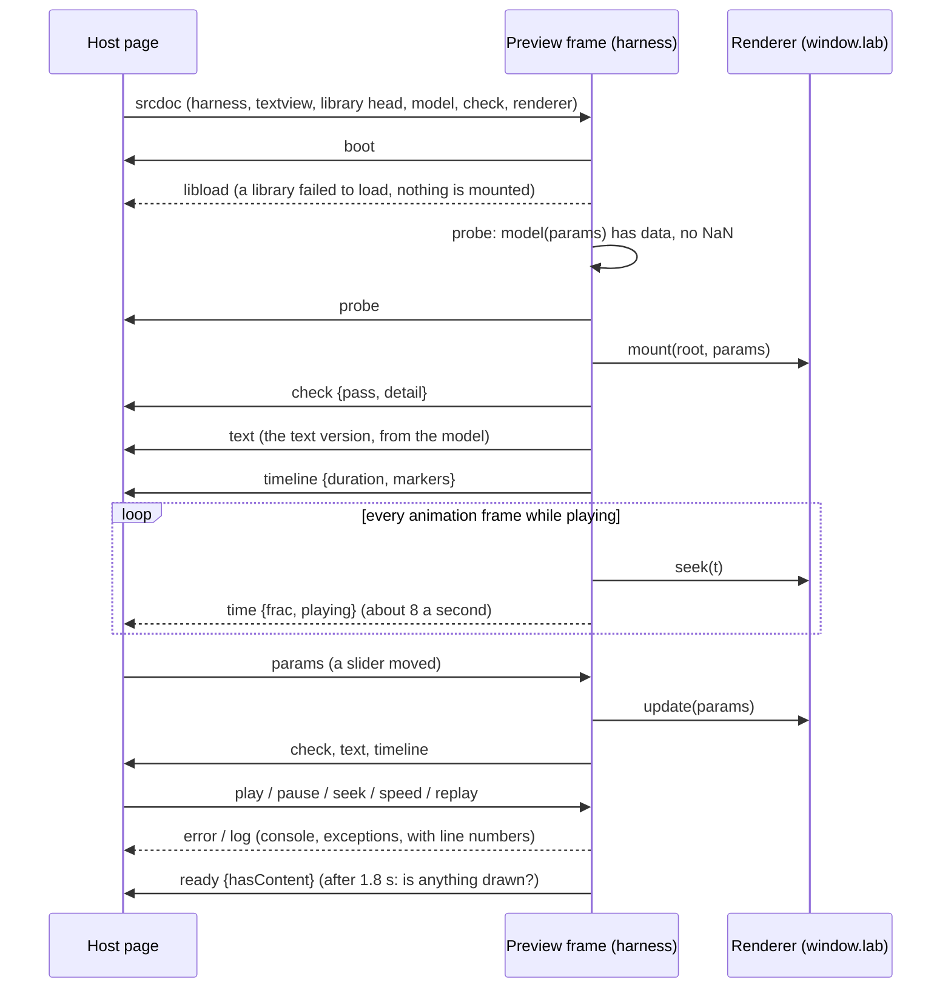
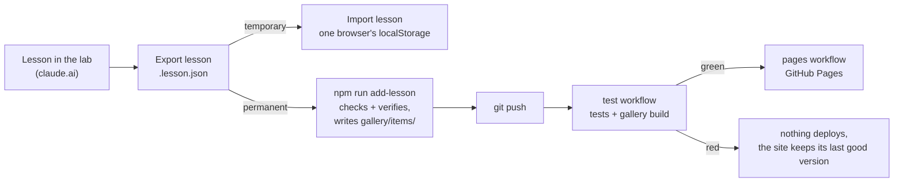

# Architecture

How Visualization Lab is put together: what is built from what, what runs where, and how the pieces talk. For the file-by-file map see `CLAUDE.md`; for the lesson rules see `AUTHORING.md`; for the developer workflow see `CONTRIBUTING.md`.

Everything rests on one rule: **one spec, many renderers**. A lesson's spec holds a pure `model(p)` that computes every number and a `check(p)` that tests the lesson's claim. Each version (A to F) is a renderer for one library that only draws what the model returns. The host page owns the controls and the playback clock. Two versions therefore differ only in how they draw, never in what they say.

## 1. From sources to the published lab

Single sources feed one build. Nothing in `dist/` is edited by hand, and the generator prompts inside the page are assembled from the guide, so a rule changes in one place.

`scripts/build.mjs` fills the page's `/*@…@*/` and `@@…@@` placeholders: the library heads and notes (`LIBS`, `RUNTIME`), the default comparisons (`PAIRS`), the four examples, the gallery's opener lesson, the kit code the page needs at run time (`template.html`, `look2d.js`, `offline.js`, `textview.js`, the 3D story kit) and the two generator prompts (spec rules and renderer contract, from `AUTHORING.md`'s marked blocks, plus the chart-forms vocabulary). An unfilled placeholder fails the build. It also copies the library files from the mirror into `dist/lib/`.

`scripts/build_gallery.mjs` builds every gallery version with `kit/build.mjs`, checks it in headless Chromium with `kit/verify.mjs` (errors, the check, a blank preview, phone overflow, embed fit, every control at its minimum and maximum), and writes `dist/gallery/data.js` and a thumbnail per lesson. Any failing version fails the build.

## 2. Inside the page at run time

**Generation.** Draft spec sends the spec prompt and the goal to Claude through the `sample` capability that claude.ai gives the page (`window.claude`). The page validates the JSON (`validateSpec`) and runs the model and check in a hidden sandboxed frame: the frame's probe walks the model's output for empty arrays and NaN, and the check runs at the defaults. A spec that fails can be sent back with the problems (`fixModel`). Generate sends the renderer prompt (the contract, the look, the phone rules, that library's notes, the spec) once per version; Refine and Fix errors send the current code with the change or the errors. Without `window.claude` (a file, GitHub Pages) the page runs in explore mode: everything except generation and chat works, and those controls are hidden.

**Previews.** Each version runs in an `<iframe sandbox="allow-scripts">` built from a `srcdoc` string, so it has an opaque origin: it cannot read the page, its storage or the user's session. The document is the harness, `kit/textview.js`, the library's `<head>` tags, the model and check, the renderer, and a boot call. Library URLs point at the first library server that works this session: `lib/` beside the page on a hosted copy, otherwise jsDelivr, then unpkg. A library that cannot load is reported as `libload`, and after the last server the pane says *Couldn't load* with a Retry button instead of an error from the renderer.

**State.** The lesson (spec, versions, chat, scores, look) lives in the browser's `localStorage` under `vislab:v1`. Export lesson writes it to a `.lesson.json` file; Import lesson reads one back into this browser only.

## 3. The preview frame protocol

The host owns time. A renderer never runs its own clock or creates controls: it exposes `window.lab = { mount, update, destroy, duration, seek(t), markers }`, and the harness inside the frame drives it from the host's messages.

| Direction | Message | Meaning |
| --- | --- | --- |
| frame → host | `boot` | the harness is running |
| frame → host | `probe` | issues found in the model's output at these params |
| frame → host | `check` | the result of `check(params)` |
| frame → host | `text` | the text version of the model's output (`kit/textview.js`) |
| frame → host | `timeline` | the renderer has a timeline: duration and step markers |
| frame → host | `time` | the playback position, while playing or after a seek |
| frame → host | `ready` | whether anything visible was drawn |
| frame → host | `error`, `log` | exceptions and console output, with line numbers into the version's code |
| frame → host | `libload` | a library file failed to load; the version is not mounted |
| host → frame | `params` | new control values: `update(params)` |
| host → frame | `play`, `pause`, `seek`, `speed`, `replay` | the shared playback clock |

With **Keep versions in sync** on, the host sends the same params and clock to every frame, so all versions show the same moment of the same model.

## 4. Downloads, the text version and accessibility

Download HTML and Export for course fill `kit/template.html`: the spec without its code fields, the model, the check, the renderer and the library head, with the template's own controls and playback (the same harness ideas, outside a sandbox). With **Works offline**, `kit/offline.js` replaces the library tags with the files themselves (classic scripts inline, ES modules as data: URLs in the import map), read from `lib/` beside the page or a CDN. `kit/build.mjs` does the same from the command line (`--course`, `--offline`).

Every preview and every downloaded page also carries a text version built from the model alone by `kit/textview.js`: the summary, the check, the steps with their times, the key numbers and small tables. It is the Text tab in the lab, the first Tab stop in a downloaded page, and the source of the step announcements for screen readers. The e2e tests run axe-core over the lab's states and over downloaded pages.

## 5. The gallery and the lesson's life

Gallery lessons live in `gallery/items/<slug>/` (spec, meta, one file per version) and are listed in `gallery/gallery.json`; four entries point at the built-in examples instead, and `opener` names the lesson a first visit shows (inlined into the page). The page loads `gallery/data.js` the first time Get inspired opens.

An import is instant and private to that browser. A published lesson takes a test run and a deploy, then reaches everyone and lasts. The gallery lesson *From the lab to the gallery: import or publish?* plays both ways.

## 6. The toolkit and the bake-off skill

`kit/` is shared by everything that builds a lesson page: the lab's downloads (its code is inlined into the page), the gallery build, the tests and the lesson-visual-bakeoff skill (`docs/SKILL.lesson-visual-bakeoff.md`), which copies `kit/` and runs the same spec check, build and verify from an agent. `kit/check_spec.mjs` checks a spec before any visual is built; `kit/verify.mjs` checks built pages in Chromium and takes screenshots.

## 7. Tests, CI and hosting

| Layer | Where | What it guards |
| --- | --- | --- |
| Unit | `test/unit/` | sources, specs, the build, the toolkit (every library family built, verified and run offline), add-lesson, workflow files |
| End to end | `test/e2e/lab.test.mjs` | everything a person clicks, against the built page and the mirror, including accessibility (axe-core) and library failures |
| Gallery | `test/gallery/` | every gallery lesson at its defaults, minimums and maximums |

`.github/workflows/test.yml` runs the unit and e2e tests on every push and the gallery sweep on main and pull requests. Both remember each lesson that passed by a fingerprint of its inputs (`scripts/lesson_hash.mjs`: the lesson's files, the kit, the checking script), so only changed lessons are built and checked again, several at a time. `.github/workflows/pages.yml` publishes `dist/` to GitHub Pages after a green run on main. Tests never use the network: libraries come from the mirror in `.cdn/`.
